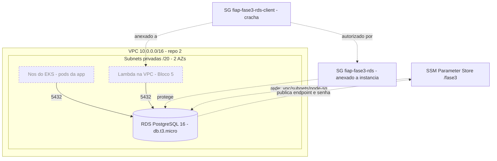

# fiap-fase3-infra-db — RDS PostgreSQL (Terraform)

Repositório **3 de 4** do Tech Challenge Fase 3 (oficina mecânica → operação corporativa em nuvem).

```
2 · infra-k8s  ──►  3 · infra-db  ──►  4 · app  ──►  1 · auth-serverless
   VPC/EKS/ECR      (você está aqui)   Quarkus/EKS    Lambda + API Gateway
```

O que este repo provisiona: **instância RDS PostgreSQL 16** gerenciada, seu **DB subnet group** nas
subnets privadas da VPC e os **dois security groups** que governam o acesso a ela — publicando
endpoint, credenciais e o SG de cliente no **SSM Parameter Store** para os repositórios 4 e 1
consumirem.

Toda a rede vem do repositório 2 via SSM: **nenhum ID de VPC, subnet ou security group é hardcodado
aqui.**

## Arquitetura

Linha cheia = provisionado por **este** repositório. Tracejado = criado por outros blocos.



A instância nasce **sem endereço público**, num subnet group que cobre as duas subnets privadas — o
RDS exige pelo menos duas AZs mesmo com `multi_az = false`, porque é onde ele pode recriar a
instância se a AZ original cair.

### O acesso é concedido por pertencimento a security group

O `fiap-fase3-rds` (anexado à instância) aceita 5432 de exatamente duas origens: o **SG primário do
cluster EKS** e o **`fiap-fase3-rds-client`**. Esse segundo grupo não protege nada — ele é um
**crachá**: nasce vazio, e quem o anexa passa a alcançar o banco.

Isso existe por um motivo concreto. No Bloco 5 a Lambda precisa falar com o RDS, mas o security
group dela ainda não existe quando este repositório é aplicado. As alternativas eram liberar o CIDR
inteiro da VPC (qualquer coisa na rede alcançaria o banco) ou fazer o repositório 1 criar uma regra
dentro de um security group que não é dele. Com o crachá, o repo 1 lê um id do SSM e anexa —
o mesmo padrão de contrato de todo o resto do projeto.

## Pré-requisitos

| Ferramenta | Versão | Observação |
|---|---|---|
| Terraform | **1.15.4** (`>= 1.11`) | `>= 1.11` por causa do lock nativo do backend S3 (`use_lockfile`) |
| AWS CLI | v2 | credenciais **temporárias** do Learner Lab (com `aws_session_token`) |
| kubectl | 1.30+ | só para o teste de fumaça (a instância não é acessível de fora da VPC) |
| Repo 2 aplicado | — | a rede vem de lá; sem ela o `plan` falha com `ParameterNotFound` |

Os scripts de conta inteira — `bootstrap-backend.ps1` (bucket do state), `refresh-gh-secrets.ps1`
(credenciais do lab nos 4 repos) e `session-start.ps1` — vivem no repositório
**`fiap-fase3-infra-k8s`** e já contemplam este repo. Aqui só existe o `preflight.ps1`.

## Uso

### 1. Preflight — sempre, antes de qualquer apply

```powershell
.\scripts\preflight.ps1
```

Responde em segundos o que custaria um apply de 10 minutos: a sessão do lab está viva? o repo 2
publicou os três parâmetros de rede? **SecureString funciona** (é onde a senha vai morar)? a chave
`alias/aws/rds` está acessível (é do que a criptografia em repouso depende)? `db.t3.micro` é ofertada
para PostgreSQL 16 nesta região? já existe RDS de pé faturando? E imprime o `backend.hcl` pronto.

### 2. Aplicar

```powershell
Copy-Item backend.hcl.example backend.hcl      # e substitua <ACCOUNT_ID> (o preflight imprime)
terraform init "-backend-config=backend.hcl"   # as aspas importam no PowerShell
terraform plan                                 # 14 recursos, nada destruído
terraform apply                                # ~8-10 min · a partir daqui: ~US$0,50/dia
```

> **PowerShell:** sem aspas, o `-backend-config=backend.hcl` é quebrado no `=` e o Terraform recebe
> dois argumentos separados.

Nenhuma variável é obrigatória: diferente do repo 2 — onde os nomes dos roles do EKS mudam a cada
reset do lab e não tinham default —, aqui tudo que varia por sessão chega pelo SSM. O
`terraform.tfvars.example` existe só para documentar o que dá para ajustar.

## Contrato entre repositórios (SSM Parameter Store)

**Entrada** — publicado pelo repo 2, lido por `data "aws_ssm_parameter"`:

| Parâmetro | Uso aqui |
|---|---|
| `/fase3/vpc/id` | VPC dos dois security groups |
| `/fase3/vpc/private-subnets` | DB subnet group (StringList → CSV → `split`) |
| `/fase3/eks/node-sg-id` | origem autorizada na regra de ingress |

> `node-sg-id` é o `cluster_security_group_id`, não um SG do node group: **node group gerenciado sem
> launch template não tem SG próprio** — os nós herdam o do cluster. Autorizar outro SG aqui faz os
> pods baterem em timeout, com sintoma de problema de rede.
>
> `/fase3/vpc/cidr` **não** é consumido. Ele existia no plano original para uma regra por faixa de
> IP, que o desenho de dois security groups tornou desnecessária.

**Saída** — publicado por este repo:

| Parâmetro | Tipo | Conteúdo | Consumido por |
|---|---|---|---|
| `/fase3/rds/endpoint` | String | **hostname, sem a porta** | Blocos 4 e 5 |
| `/fase3/rds/port` | String | `5432` | Blocos 4 e 5 |
| `/fase3/rds/db-name` | String | `oficina_db` | Blocos 4 e 5 |
| `/fase3/rds/username` | String | `postgres` | Blocos 4 e 5 |
| `/fase3/rds/password` | **SecureString** | senha gerada no apply | Blocos 4 e 5 |
| `/fase3/rds/client-sg-id` | String | crachá de acesso ao banco | Bloco 5 |

> **`endpoint` é só o host.** O atributo `endpoint` do provider AWS já vem como `host:5432`;
> publicá-lo assim, ao lado de um parâmetro de porta, produziria `host:5432:5432` em qualquer URL
> montada pelos consumidores. Por isso publicamos `address`.

### O que a app espera (Bloco 4)

Os valores acima não são livres — eles casam com o que a aplicação Quarkus já usa (`oficina_db`,
`postgres`, PostgreSQL 16, schema `public`). Mudar `db_name` ou `db_username` aqui sem mudar lá
quebra o Flyway na primeira migration.

⚠️ **Cada `destroy` + `apply` gera uma senha nova.** O Secret do Kubernetes precisa ser reescrito a
partir do SSM em **todo** deploy; se ficar com a credencial da sessão anterior, a app sobe e falha ao
conectar.

O pgjdbc do Quarkus 3.26 usa `sslmode=prefer` e negocia TLS sozinho, mas vale explicitar
`?sslmode=require` na JDBC URL: troca um default de driver por um contrato visível.

### O que a Lambda precisa saber (Bloco 5)

1. **Anexe o `/fase3/rds/client-sg-id`** às ENIs da função — não crie regra no SG do RDS. Se a
   função precisar de saída para outros serviços, crie um SG próprio no repo 1 e anexe os **dois**:
   security groups são aditivos e a Lambda aceita até 5. O crachá é deliberadamente restrito à 5432.
2. **TLS é obrigatório** — verificado nesta instância: `default.postgres16` traz
   `rds.force_ssl = 1` (source `system`). Isso não afeta a app — pgjdbc usa `sslmode=prefer` e
   negocia TLS sozinho, e a conexão sobe em TLSv1.3 —, mas o `pg` do Node tem **`ssl: false` por
   default** e leva recusa do servidor. O erro é este, e ele parece problema de rede:

   ```
   FATAL: no pg_hba.conf entry for host "10.0.x.x", user "postgres",
          database "oficina_db", no encryption
   ```

   A função precisa nascer com `ssl` habilitado. (`SHOW rds.force_ssl` responde
   *unrecognized configuration parameter* — não é sinal de que está desligado; a regra vive no
   `pg_hba`, não num GUC consultável. Confira por `aws rds describe-db-parameters`.)

Mantemos o parameter group default de propósito: desligar TLS para conveniência do Bloco 5 é
exatamente o tipo de atalho que a banca pergunta.

## Verificação (Definition of Done)

> Executado de ponta a ponta em **2026-08-21** na conta do lab: `plan` = 14 to add · `apply` =
> **14 added, 0 changed, 0 destroyed** (instância pronta em 6m33s) · RDS `available` em
> PostgreSQL **16.13** · `plan` pós-apply = **"No changes"** (o prefixo de major não gera drift) ·
> smoke test abaixo verde · `destroy` limpo, 14 destroyed.

```powershell
aws rds describe-db-instances --db-instance-identifier fiap-fase3-postgres `
  --query "DBInstances[0].DBInstanceStatus" --output text          # available  <- DoD do bloco

aws ssm get-parameters-by-path --path /fase3/rds --recursive --query "Parameters[].Name"
```

### Teste de fumaça — rode uma vez, logo após a instância ficar `available`

Prova a regra do security group de ponta a ponta e de-risca o Bloco 4. Exige o cluster do repo 2 de
pé: com `publicly_accessible = false` **não há como alcançar o banco do seu notebook** — todo
diagnóstico passa por um pod.

```powershell
$h = aws ssm get-parameter --name /fase3/rds/endpoint --query Parameter.Value --output text
$p = aws ssm get-parameter --name /fase3/rds/password --with-decryption --query Parameter.Value --output text

# Senha por PGPASSWORD, host e base por flag: numa connection string, um caractere especial da senha
# viraria delimitador de URI e o erro apareceria como falha de conexão — caçando security group.
kubectl run psql --image=postgres:16 --restart=Never --env="PGPASSWORD=$p" -- `
  psql -h $h -U postgres -d oficina_db -c "select version(), current_database(), current_user;"

# Ler por `logs`, e não por `--rm -i`: o attach depende de stdin, que num terminal não interativo
# (script, CI) fecha na hora e engole a saída — o pod roda, some, e você não vê o resultado.
kubectl wait --for=jsonpath='{.status.phase}'=Succeeded pod/psql --timeout=120s
kubectl logs psql
kubectl delete pod psql --now
```

Saída esperada:

```
                              version                              | current_database | current_user
-------------------------------------------------------------------+------------------+--------------
 PostgreSQL 16.13 on x86_64-pc-linux-gnu, compiled by ...           | oficina_db       | postgres
```

Falhou? O suspeito é o security group, não a rede: confirme que `/fase3/eks/node-sg-id` carrega o
`cluster_security_group_id` do EKS.

## Custo e destruição

| Item | US$/dia ligado 24h |
|---|---|
| db.t3.micro On-Demand, single-AZ | ~0,41 |
| 20 GB gp2 | ~0,08 |
| Backup automático (1 dia, ≤100% do storage) | 0 |
| **Total** | **~0,50** |

Com o Bloco 2 ligado (EKS + NAT + 2 nós, ~US$5,60/dia), a conta fica em **~US$6,10/dia**.

> **Parar a instância NÃO substitui o `destroy`:** o Learner Lab **religa RDS parado em 7 dias**, e
> ele volta faturando sem ninguém perceber. O painel de budget do lab atrasa 8–12h — nunca use como
> sinal de segurança.

**Ordem de destruição entre repos: 1 → 4 → 3 → 2.**

```powershell
terraform destroy      # ~5-8 min
```

`skip_final_snapshot = true` evita que o snapshot final sobreviva cobrando, e
`deletion_protection = false` é o que permite o destroy rodar.

### Recuperação: repo 2 destruído antes do repo 3

A ordem virou dependência dura nos dois sentidos. Destruir o repo 2 primeiro dá `DependencyViolation`
(subnets e security group em uso) **e** deixa este repositório sem saída limpa: os
`data "aws_ssm_parameter"` são resolvidos para montar o plano de destroy e falham com
`ParameterNotFound`. `-refresh=false` **não** resolve — data sources são lidos no plan de qualquer
jeito.

```powershell
# 1. Republicar os 3 parametros so para o destroy conseguir resolver os data sources.
#    O TIPO tem que casar com o que o repo 2 publica: private-subnets e StringList, e o SSM NAO
#    deixa trocar o tipo de um parametro existente — errar aqui quebra o apply do repo 2 na
#    proxima sessao, na primeira coisa que voce faz.
aws ssm put-parameter --name /fase3/vpc/id              --value "vpc-0"    --type String     --overwrite
aws ssm put-parameter --name /fase3/vpc/private-subnets --value "subnet-0" --type StringList --overwrite
aws ssm put-parameter --name /fase3/eks/node-sg-id      --value "sg-0"     --type String     --overwrite

terraform destroy   # 2. NUNCA `apply` neste estado: com valores falsos o plan pede replace dos SGs.

# 3. Limpar. Sem isto a sessao seguinte comeca com um contrato que mente ate o repo 2 sobrescrever.
aws ssm delete-parameter --name /fase3/vpc/id
aws ssm delete-parameter --name /fase3/vpc/private-subnets
aws ssm delete-parameter --name /fase3/eks/node-sg-id
```

## Decisões (resumo — detalhamento nos RFCs/ADRs do Bloco 7)

| Decisão | Motivo |
|---|---|
| Acesso por pertencimento a SG (crachá) em vez de CIDR | regra mínima, e nenhum repositório precisa criar recurso dentro de outro |
| Senha via `random_password` + SSM SecureString | ela nunca existe no git nem em disco. Fica no state — mas as alternativas também: `data "aws_ssm_parameter"` materializa o valor decifrado no state do mesmo jeito. Só `password_wo` evitaria, ao custo de um modo de falha silencioso (valor ephemeral é regerado a cada execução; um apply interrompido divergiria senha e SSM) |
| Sem KMS customer-managed | o lab não permite criar chave; usamos as gerenciadas `aws/ssm` e `aws/rds` |
| `db.t3.micro`, single-AZ, gp2 | tetos do Learner Lab (gp3 e enhanced monitoring bloqueados) e ambiente único (F4) |
| `engine_version = "16"` (prefixo) | casa com o dev (`postgres:16`) e deixa a AWS resolver o minor sem gerar diff |
| `engine_lifecycle_support` desligado | extended support cobra por vCPU-hora — mais que a própria instância |
| `max_allocated_storage = 0` | storage autoscaling sobe sozinho e **não desce**; num budget fixo isso é custo permanente |
| Parameter group default (com `rds.force_ssl`) | TLS obrigatório é o comportamento certo; quem se adapta é o cliente |
| Contrato por SSM, não `terraform_remote_state` | o state carrega tudo em texto plano e exigiria dar leitura do bucket inteiro às 4 pipelines |

## Troubleshooting

| Sintoma | Causa provável / solução |
|---|---|
| `plan` falha com **`ParameterNotFound`** | o repo 2 não está aplicado nesta sessão. Ordem de deploy: 2 → 3 → 4 → 1 |
| `terraform init/plan` com erro **x509** | interceptação TLS local (antivírus com HTTPS scanning). Desligue o scan de HTTPS |
| `ExpiredToken` / `InvalidClientTokenId` | sessão do lab expirou (~4h). Renove e rode `refresh-gh-secrets.ps1` (repo 2) |
| App/pod dá **timeout** ao conectar | security group, não rede. Confirme que `/fase3/eks/node-sg-id` é o `cluster_security_group_id` |
| Lambda dá erro de conexão onde a app funciona | `rds.force_ssl = 1`: o `pg` do Node não negocia TLS sozinho. Habilite `ssl` no cliente |
| `InvalidParameterValue` em **`storage_encrypted`** | o lab negou a chave `alias/aws/rds`. Rode o preflight; se confirmar, use `storage_encrypted = false` |
| `InvalidParameterCombination` na **classe** | `db.t3.micro` não ofertada para essa versão. O preflight testa isso; alternativa é `db.t3.small` |
| Senha do SSM não conecta | a instância foi recriada e a senha mudou. Releia o parâmetro e redeploye a app (Bloco 4) |
| `destroy` falha lendo data source | repo 2 já foi destruído. Ver **Recuperação** acima |
| `Error acquiring the state lock` | lock preso de execução interrompida: `aws s3 cp s3://<bucket>/infra-db/terraform.tfstate.tflock -` para achar o ID e `terraform force-unlock <ID>` |
| Instância reapareceu sozinha | o lab **religa RDS parado em 7 dias**. Só o `destroy` resolve |
